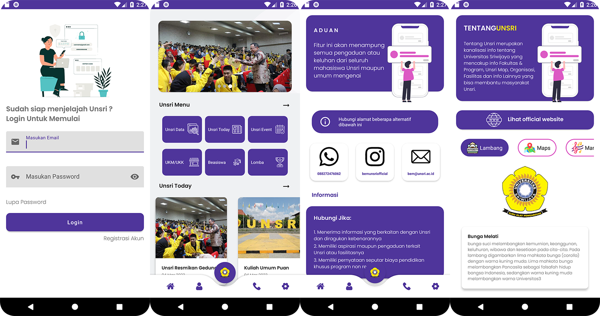

# Hi Unsri - Aplikasi Informasi Seputar Universitas Sriwijaya

## Introduction

Hi, Unsri is an innovative and new information channel specifically designed to provide a variety of up-to-date and useful information for all students of Sriwijaya University (Unsri). With the establishment of this information channel by the Unsri Student Executive Body (BEM UNSRI), Unsri students will find it easier and faster to get access to news, announcements, campus activities, and various other important information related to campus life and their lectures.

## Fitur

The Hi Unsri application provides various features that help users get the latest information about Sriwijaya University. Here are some of the features available:

1. **Unsri Today**: Displays a list of news information that happened at Sriwijaya University recently.

2. **Unsri Competition**: Displays a list of information on Sriwijaya University competitions.

3. **Unsri Scholarship**: Displays a list of Sriwijaya University scholarship information.

4. **Unsri UKM**: Displays a list of information on UKM Universitas Sriwijaya.

5. **Unsri Event**: Displays a list of Sriwijaya University event information.

6. **Unsri Complaints**: The application supports students/the general public to make complaints at Sriwijaya University.

7. ***About Unsri**: Displays information about Unsri in the form of vision and mission, Unsri maps and Unsri goals.

## Application Display
Below are some screenshots of the app showing the various features available in Hi Unsri.

## Download Application
[https://drive.google.com/file/d/1WwJognsJKK92IZxyC1qlHE3oQT-Z9ndS/view?usp=sharing](https://play.google.com/store/apps/details?id=com.unsriinfo.app&hl=en-ID)

## Kontak
If you have questions or suggestions regarding this application, you can contact the Hi Unsri team via email raihan.ghifari1603@gmail.com.
